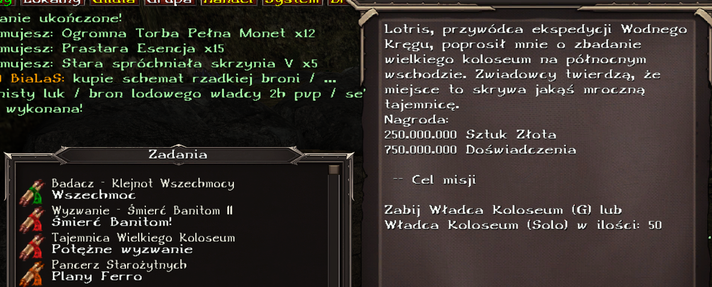

# Zadania - Podziemia Jarkendar

Spis treści:
1. [Misje Poziom 81](#poziom-81)
2. [Misje Poziom 82](#poziom-82)
3. [Misje Poziom 83](#poziom-83)

# Poziom 81

## Badacz - Pradawne Księgi: _Pradawne Księgi_
**Opis:**
_Badacz kazał przynieść mi 30 Pradawnych Ksiąg._

**Zleceniodawca:**
Seraphius

**Cel misji:**
- Dostarcz Pradawna Księga: 30

**Nagroda:**
- Silny na starożytnych: 10 (Stały bonus)

## To mu się już nie przyda...: _W poszukiwaniu..._
**Opis:**
_Przemierzając katakumby natrafiłem na martwe ciało. Muszę przyznać, że sieci tych pająków całkiem dobrze je zakonserwowały. Po przeszukaniu ciała znalazłem klucz. A skoro mam klucz, to gdzieś musi być i zamek..._

**Zleceniodawca:**
Martwe Ciało

**Cel misji:**
- Porozmawiaj z Stara skrzynia

**Nagroda:**
- 2 000 000 sztuk złota
- 5 000 000 doświadczenia
- 250 Dukaty
- 1 Antyczny Klucz
- 3 Antyczna Ruda
- 12 Prastara Esencja
- Odłamek Jedności

## Samemu to nie robota...: _Porozmawiaj z Oberonem_
**Opis:**
_Magnus polecił mi zebrać drużynę w podziemia, najlepiej zrobię, gdy zajmę się tym jak najszybciej._

**Zleceniodawca:**
Magnus

**Cel misji:**
- Porozmawiaj z Oberon

**Nagroda:**
- 750 000 sztuk złota
- 2 500 000 doświadczenia

## Samemu to nie robota...: _Porozmawiaj z Seraphiusem_
**Opis:**
_Magnus polecił mi zebrać drużynę w podziemia, najlepiej zrobię, gdy zajmę się tym jak najszybciej._

**Zleceniodawca:**
Oberon

**Cel misji:**
- Porozmawiaj z Seraphius

**Nagroda:**
- 750 000 sztuk złota
- 2 500 000 doświadczenia

## Samemu to nie robota...: _Porozmawiaj z Terenem_
**Opis:**
_Hmm... Przydaliby się jacyś myśliwi. Może Teren i Wolf?_

**Zleceniodawca:**
Seraphius

**Cel misji:**
- Porozmawiaj z Teren

**Nagroda:**
- 750 000 sztuk złota
- 2 500 000 doświadczenia

## Samemu to nie robota...: _Porozmawiaj z Wolf_
**Opis:**
_Hmm... Przydaliby się jacyś myśliwi. Może Teren i Wolf?_

**Zleceniodawca:**
Teren

**Cel misji:**
- Porozmawiaj z Wolf

**Nagroda:**
- 750 000 sztuk złota
- 2 500 000 doświadczenia

## Samemu to nie robota...: _Porozmawiaj z Amir_
**Opis:**
_Hmm... Może któryś z piratów? Amir?_

**Zleceniodawca:**
Wolf

**Cel misji:**
- Porozmawiaj z Amir

**Nagroda:**
- 750 000 sztuk złota
- 2 500 000 doświadczenia

## Samemu to nie robota...: _Porozmawiaj z Magnusem_
**Opis:**
_Dobrze, wypadałoby złożyć raport Magnusowi, obstawiam, że chwilę się nie zobaczymy._

**Zleceniodawca:**
Amir

**Cel misji:**
- Porozmawiaj z Magnus

**Nagroda:**
- 20 000 000 sztuk złota
- 50 000 000 doświadczenia
- 10 Mikstura Bestii
- 10 Mikstura Władcy
- 5 Symbol Wzniesienia
- 3 Emblemat Potęgi

## Pajęczy przysmak: _Dostarcz przedmioty dla Amira_
**Opis:**
_Amir chyba trochę zgłodniał, całkiem ciekawy wybór na posiłek..._

**Zleceniodawca:**
Amir

**Cel misji:**
- Dostarcz Noga Pająka: 300

**Nagroda:**
- 50 000 000 sztuk złota
- 150 000 000 doświadczenia
- 15 Krystaliczny Pył

## Podziemne polowanie - Pająki: _Zgładź Pająki_
**Opis:**
_Teren i Wolf zgotowali pajęczaką niezłe kongo, teraz pora abym i ja się wykazał._

**Zleceniodawca:**
Wolf

**Cel misji:**
- Zabij Straszliwy Pająk: 1200

**Nagroda:**
- 200 000 sztuk złota
- 500 000 doświadczenia

## Nowe znajomości: _Dostarcz przedmioty dla Terena_
**Opis:**
_Nawet nie zdążyłem się porządnie zapoznać a już oczekują odemnie wsparcia. Cóż załatwie im te zapasy, może dowiem się czegoś więcej._

**Zleceniodawca:**
Teren

**Cel misji:**
- Dostarcz Tropikalne Mięso: 750
- Dostarcz Rum: 50
- Dostarcz Potrawka Suon Gzik: 10

**Nagroda:**
- 15 000 000 sztuk złota
- 50 000 000 doświadczenia
- Moneta Chwały
- 3 Mikstura Potęgi
- 3 Starożytny Zwój+

## Pajęczaki: _Dostarcz przedmioty dla Terena_
**Opis:**
_Nienawidze pająków... Cóż, tyle już zwojowałem, że chyba sobie poradze._

**Zleceniodawca:**
Teren (wymaga ukończenia misji [Nowe znajomości: Dostarcz przedmioty dla Terena](#nowe-znajomości-dostarcz-przedmioty-dla-terena))

**Cel misji:**
- Dostarcz Pajęcza Sieć: 30
- Dostarcz Joint: 10

**Nagroda:**
- 25 000 000 sztuk złota
- 75 000 000 doświadczenia
- Moneta Chwały
- 5 Symbol Wzniesienia
- 3 Starożytny Zwój+

## Anihilacja: Piekielne Ruiny Klasztoru!: _Wyzwanie I_
**Opis:**
_Okazuje się, że w Ruinach klasztoru zalęgły się obrzydliwe siły zła._

**Zleceniodawca:**
Przeor Ertos

**Cel misji:**
- Zabij Piekielny Ork Szaman: 15

**Nagroda:**
- 10 000 000 sztuk złota
- 10 Antyczna Ruda
- Zwykły Artefakt Piekła

## Anihilacja: Piekielne Ruiny Klasztoru!: _Wyzwanie II_
**Opis:**
_Okazuje się, że w Ruinach klasztoru zalęgły się obrzydliwe siły zła._

**Zleceniodawca:**
Rozpoczyna się automatycznie po ukończeniu misji [Anihilacja: Piekielne Ruiny Klasztoru!: Wyzwanie I](#anihilacja-piekielne-ruiny-klasztoru-wyzwanie-i)

**Cel misji:**
- Zabij Piekielny Ork Szaman: 25

**Nagroda:**
- 10 000 000 sztuk złota
- 10 Antyczny Klucz
- Zwykły Artefakt Piekła

# Poziom 82

## Zły Znak: _Dostarcz przedmioty dla Seraphiusa_
**Opis:**
_Seraphius potrzebuje znaków śmierci, mogę je zdobyć pokonując poszukiwaczy_

**Zleceniodawca:**
Seraphius

**Cel misji:**
- Dostarcz Znak Śmierci: 50
- Porozmawiaj z Seraphius

**Nagroda:**
- 5 000 000 sztuk złota
- 10 000 000 doświadczenia
- 10 Klucz do Jaskini Pająków
- 10 Klucz do Obozu Banitów

## Pajęczaki II: _Zgładź pająki_
**Opis:**
_Znowu te zasrane pająki!_

**Zleceniodawca:**
Teren

**Cel misji:**
- Zabij Straszliwy Pająk: 500

**Nagroda:**
- BRAK

## Pośród mroku - Prolog: _Porozmawiaj z Seraphius_
**Opis:**
_Pora zejść w podziemia i porozmawiać z Seraphiusem... Ciekawe co mnie tam spotka._

**Zleceniodawca:**
Magnus

**Cel misji:**
- Porozmawiaj z Seraphius

**Nagroda:**
- 2 000 000 sztuk złota
- 5 000 000 doświadczenia

## Pośród mroku - Prolog: _Porozmawiaj z Albrechtem_
**Opis:**
_Seraphius zajmuje się przygotowywaniem mikstur dla reszty drużyny, pójdę zagadać z innymi. Hmm no to może Albrecht._

**Zleceniodawca:**
Seraphius

**Cel misji:**
- Porozmawiaj z Albrecht

**Nagroda:**
- 2 000 000 sztuk złota
- 5 000 000 doświadczenia

## Pośród mroku - Oczyszczanie: _Oczyść Jaskinie_
**Opis:**
_Albrecht chyba ma niezłego cykora. HA! A niby rycerz... No to pora sprawdzić co kryje się w głębi._

**Zleceniodawca:**
Albrecht

**Cel misji:**
- Zabij Straszliwy Pająk: 200

**Nagroda:**
- 2 000 000 sztuk złota
- 5 000 000 doświadczenia

# Poziom 83

## Anihilacja - Oczyścić podziemia: _Dojazd!_
**Opis:**
_Zjawa poprosiła mnie o oczyszczenie podziemi. Zajmę się tym kiedy uporam się z innymi problemami. Przeklęte korytarze, podziemia to istny labirynt._

**Zleceniodawca:**
Pradawny Mściciel

**Cel misji:**
- Zabij Straszliwy Pająk: 1000
- Zabij Pradawny Mściciel: 1000
- Zabij Pradawny Berserker: 1000
- Zabij Słaby Banita: 1000
- Zabij Posąg Ostateczności: 10
- Zabij Dowódca Banitów: 10
- Zabij Królowa Pająków: 10
- Zabij Król Pająków: 200

**Nagroda:**
- 200 000 sztuk złota
- 500 000 doświadczenia

## Rzadkie Trofea z Podziemi I: _Dostarcz przedmioty do Amira_
**Opis:**
_Amir poprosił mnie o dostarczenie mu Nóg olbrzymiego Pająka. Tylko skąd ja mu je wezmę? Mniejsza, może los da i trafię na jakiegoś przerośniętego pająka.._

**Zleceniodawca:**
Amir

**Cel misji:**
- Dostarcz Noga Olbrzymiego Pająka: 3
- Porozmawiaj z Amir

**Nagroda:**
- 5 000 000 sztuk złota
- 10 000 000 doświadczenia
- 1 Odłamek Jedności
- 2 Pradawny Klejnot
- 120 Prastara Esencja

## Okrutny los: _Raport_
**Opis:**
_Przemierzając opuszczone tereny natknąłem się na ciało kogoś z kręgu wody. Znalazłem przy nim pierścień z akwamarynem oraz jakiś raport. Powinienem dostarczyć go magom wody._

**Zleceniodawca:**
Martwy Posłaniec

**Cel misji:**
- Porozmawiaj z Magnus

**Nagroda:**
- 1 000 000 sztuk złota
- 2 500 000 doświadczenia

## Ekspedycja: _Rozeznanie_
**Opis:**
_Magnus poprosił mnie, abym udał się do obozu Lotrisa i dostarczył mu paczkę od magów wody. Grupa Lotrisa znajduje się gedzieś na opuszczonych terenach, podobno rozbili tam swój obóz. (Porozmawiaj z ruth)_

**Zleceniodawca:**
Magnus (Wymaga ukończenia misji [Okrutny los](#okrutny-los-raport))

**Cel misji:**
- Porozmawiaj z Ruth

**Nagroda:**
- 1 000 000 sztuk złota
- 2 500 000 doświadczenia

## Ekspedycja: _Rozeznanie_
**Opis:**
_Hmm... Ci ludzie wydają się nie być zbytnio ufni. Tak czy siak - muszę znaleźć Lotrisa, strażnik przy wejściu powiedział mi, że znajdę go w środku obozu, tuż przy ognisku._

**Zleceniodawca:**
Ruth (Wymaga ukończenia misji [Ekspedycja: Rozeznanie](#ekspedycja-rozeznanie))

**Cel misji:**
- Porozmawiaj z Lotris

**Nagroda:**
- 10 000 000 sztuk złota
- 25 000 000 doświadczenia
- 5 Antyczny Klucz

OBOZ LOTRISA MISJE odblokowywuja sie po zrobieniu ekspedycja rozeznanie

## Lekarstwo dla Martela: _Pierwsza pomoc!_
**Opis:**
_Błąkając się po obozie Lotrisa natrafiłem na Menny'ego, który opowiedział mi o jednym z członków ekspedycji - Martelu. Został on poważnie raniony przez pumę. Mogę rozejrzeć się po okolicy i przynieść Menny'emu składniki potrzebne do stworzenia lekarstwa. Kilka tkanin również mu się przyda..._

**Zleceniodawca:**
Menny

**Cel misji:**
- Dostarcz Maść Przeciwbólowa: 3
- Dostarcz Kwałek Płótna: 20
- Porozmawiaj z Menny

**Nagroda:**
- 20 000 000 sztuk złota
- 25 000 000 doświadczenia
- 500 Punktów życia

## Łowca Głów - Banici II: _Inwigilacja_
**Opis:**
_Umbra dał mi zlecenie, abym zajął się banitami, którzy mają obóz nieopodal. Nic trudnego._

**Zleceniodawca:**
Umbra

**Cel misji:**
- Zabij Słaby Banita: 500
- Zabij Banita: 250
- Zabij Szef Banitów: 3

**Nagroda:**
- 1 000 000 sztuk złota
- 2 500 000 doświadczenia

## Rzadkie Trofea I: _Skóry Leśnego Zębacza_
**Opis:**
_W obozie Lotrisa spotkałem człowieka o imieniu Ketris, będzie kupował ode mnie trofea, które uda mi się zdobyć z tutejszych potworów... Na początek skóry leśnych zębaczy. Z tego co pamiętam mowa była o dwóch tuzinach._

**Zleceniodawca:**
Ketris

**Cel misji:**
- Dostarcz Skóra Leśnego Zębacza: 25
- Dostarcz Wątroba Zębacza: 50
- Porozmawiaj z Ketris

**Nagroda:**
- 20 000 000 sztuk złota
- 25 000 000 doświadczenia
- Silny na potwory: 2

## Nocny Łowca: _Potężna Bestia_
**Opis:**
_Mikkel - jeden ze strażników w obozie Lotrisa opowiedział mi o Nocnym Łowcy - zębaczu, który zaatakował jednego z ich ludzi. Ktoś musi się nim zająć i wypadło na mnie..._

**Zleceniodawca:**
Mikkel

**Cel misji:**
- Zabij Leśny Zębacz: 200
- Zabij Nocny Łowca: 1

**Nagroda:**
- 1 000 000 sztuk złota
- 2 500 000 doświadczenia

## Tylko kilka buchów...: _Usmolony Ruth_
**Opis:**
_Ruth - jeden z wartowników w obozie Lotrisa chce, abym przyniósł mu kilka skrętów bagiennego ziela. Szuka też czegoś mocniejszego. Może Zielony Nowicjusz się nada?_

**Zleceniodawca:**
Ruth

**Cel misji:**
- Dostarcz Joint: 50
- Dostarcz Zielony Nowicjusz: 15
- Porozmawiaj z Ruth

**Nagroda:**
- 20 000 000 sztuk złota
- 25 000 000 doświadczenia
- Mikstura Złoczyńcy

## Smakosz: _Zapasy_
**Opis:**
_Fane prosił mnie abym dostarczył mu wątroby zębacza oraz nogi pająków. Ma zrobić z tego jakiś gulasz. Ehh... Nie brzmi to zbyt dobrze._

**Zleceniodawca:**
Fane

**Cel misji:**
- Dostarcz Wątroba Zębacza: 100
- Dostarcz Noga Pająka: 100
- Porozmawiaj z Fane

**Nagroda:**
- 20 000 000 sztuk złota
- 25 000 000 doświadczenia
- Obrażenia końcowe PvM: 1

## Antymagia: _Posągi Ostateczności_
**Opis:**
_Posągi w tej części doliny według maga Neorusa osłabiają jego magię. Lepiej będzie jeżeli zostaną zniszczone._

**Zleceniodawca:**
Neorus

**Cel misji:**
- Zabij Posąg Ostateczności: 50

**Nagroda:**
- 20 000 000 sztuk złota
- 25 000 000 doświadczenia
- 5 Antyczny Klucz

## Pomścić poległych!: _Polowanie_
**Opis:**
_Lotris znalazł dla mnie robotę. Mam zająć się stworem, który załatwił ich ostatniego posłańca. Powinienem rozejrzeć się w okolicy, tak gdzie znalazłem ciało..._

**Zleceniodawca:**
Lotris

**Cel misji:**
- Zabij Krwiożercza Puma: 3

**Nagroda:**
- 1 000 000 sztuk złota
- 2 500 000 doświadczenia

## Pomścić poległych!: _Polowanie_
**Opis:**
_Spotkałem niejakiego Vartha. Prosił mnie o dostarczenie zapisków, notatek lub innych przydatnych dla niego rzeczy. Chce zaimponować magowi Neorusowi, ciekawy motyw... Wspomniał coś o nagrodzie, a żaden pieniądz nie śmierdzi, dlatego zgodziłem rozejrzeć się po okolicy..._

**Zleceniodawca:**
Varth

**Cel misji:**
- Dostarcz Zapiski z Katakumb: 12
- Dostarcz Notatka poszukiwacza przygód: 10
- Dostarcz Zapiski kleryków z podziemi: 3
- Dostarcz Bandycki Sygnet: 5
- Dostarcz Stary Rytualny Miecz: 5
- Dostarcz Noga Olbrzymiego Pająka: 5
- Dostarcz Pozłacane Trofeum: 1
- Porozmawiaj z Varth

**Nagroda:**
- 20 000 000 sztuk złota
- 25 5000 000 doświadczenia
- Obrażenia: 40
- Sakralne Złoto
- Sakralna Woda

## Chciwość nie popłaca: _Poszukiwanie_
**Opis:**
_W trakcie eksplorowania doliny natrafiłem na martwego członka z ekspedycji Lotrisa. Jego kieszenie wypełnione były złotem i kosztownościami. Postanowiłem nieco powęszyć w okolicy, może też uda mi się coś znaleźć..._

**Zleceniodawca:**
Martwy członek ekspedycji

**Cel misji:**
- Zabij Tajemniczy Skarb: 10
- Zabij Skarb: 5

**Nagroda:**
- 2 000 000 sztuk złota
- 25 000 000 doświadczenia
- Bryła Złota